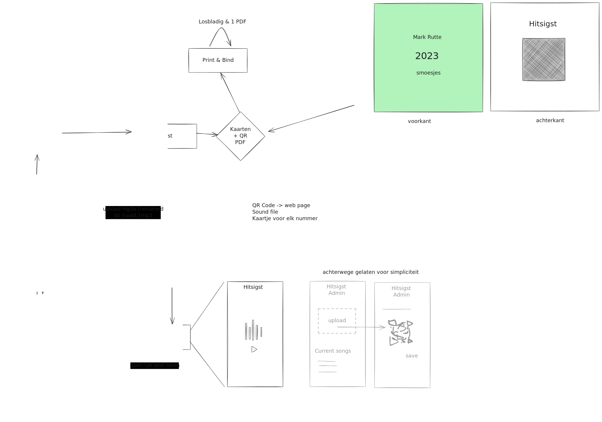

# Hitsigst

**Hitsigst** is a party music game where you must order songs you hear by the year they came out.
This project is a Christmas present for Mark's parents.
The repository includes software to organize music, host a website, and create playing cards with QR codes.
The playing cards are generated using templates typeset with [Typst](https://typst.app/).

> [!WARNING]
> This project is strictly for personal use.

## How to play

The game loop goes as follows.

1. Pick a music card from the pile and scan the QR code to play the song.
2. Guess when the song first came out and place the card in your music timeline.
3. Reveal the card. Guessed right? You keep the card in your timeline.

The first one to have a timeline of 10 cards wins!

## How to install

There are 4 main steps for setting up Hitsigst.

1. Prepare a CSV with your music and run it through `hitrelease-cli prepare` See [`prepare.rs`](hitsigst-cli/src/prepare.rs).
2. Upload music to S3-compatible object storage using `upload_to_r2.sh`.
3. Generate your deck of cards with `hitrelease-cli typst` (and probably have them printed as well).
4. Host `hitrelease-server` as a personal service.

CLI reference for `prepare` and `typst` is shown below.

**`hitsigst-cli prepare`**
```
hitsigst-cli prepare --help
Process song data for Hitsigst

Usage: hitsigst-cli prepare [OPTIONS] --from <FILE>

Options:
  -f, --from <FILE>         CSV file with song title, artist, and year of release
  -o, --output <FILE>       Output path for the Hitsigst data file [default: hitsigst.json]
  -d, --download-dir <DIR>  Output directory for downloaded songs [default: hitsigst-songs]
  -n, --no-download         Skip downloading songs
  -h, --help                Print help
```

**`hitsigst-cli typst`**
```
hitsigst-cli typst --help
Generate game cards using Typst

Usage: hitsigst-cli typst [OPTIONS] --from <FILE>

Options:
  -f, --from <FILE>    Hitsigst data file
  -o, --output <FILE>  Output path for the game cards PDF [default: hitsigst.pdf]
  -h, --help           Print help
```

## Architectural overview

This is roughly the overview of the system as we planned it out:


